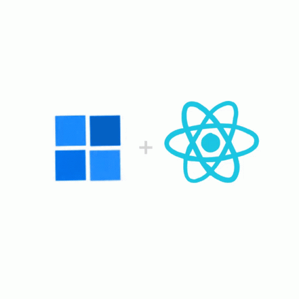

### React JS 🧑‍💻



1. React CDN - https://legacy.reactjs.org/docs/cdn-links.html
2. Github - https://github.com/namastedev/namaste-react
3. Discord - https://discord.com/channels/1057696352890519662/1060238868756037632/threads/1140880978752065637
4. How React internal works - https://www.youtube.com/watch?v=7YhdqIR2Yzo
5. Bundler - https://www.showwcase.com/show/26900/what-is-a-bundler
6. bundle code with parcel for production env - npx parcel build .\Inception\index.html  & remove the "main" from package.json file 
7. Last 2 version of any browsers supported using browserslist : []

### Parcel Bundler - https://github.com/parcel-bundler/parcel
1. run the server - npx parcel .\Inception\index.html
2. HMR - hot module replacement
3. File watching algorithm - written in c++
4. Light weight algo written in rust
5. Caching things so every time no need to start from scratch.
6. Image optimization
7. Consistent hashing
8. code splitting , differential bundling - support older browser and new browser
9. tree shaking
10. Diagnostic report - npx parcel build .\Inception\index.html --experimental-scope-hoisting --no-minify --no-source-maps --no-cache --log-level 4 --experimental-skip-optimization
11. Parcel is a web application bundler, differentiated by its developer experience. It offers blazing fast performance utilizing multicore processing, and requires zero configuration.
12. Host on https 


### Lecture - 3 Foundation

1. package.json has script tag with the help of that we can run the command : npm run start , npm run build
2. npm run start - run the server
3. npm run build - build the code for production
4. npm run build -- --no-minify - build the code for production without minification
5. JSX make our developer life easy , JSX is not a requirement for using React. Using React without JSX is especially convenient when you don't want to set up compilation in your build environment.
6. Babel is JS compiler which is converted JSX into react.createEkement() function
7. Babel is a JavaScript compiler. Use next generation JavaScript, today.
8. Babel is a toolchain that is mainly used to convert ECMAScript 2015+ code into a backwards compatible version of JavaScript in current and older browsers or environments. ( support new script in old browser )
9. class based component: old way write code
fucntional components: new way to write code
alwyas it starts with capital letter
10. component composition - combine multiple components
11. using {} we can write JS code inside JSX
12.  way to render react component root.render(<HeadingComponent />);

### Lecture - 4
1. props - props are immutable ( can not be changed )
2. props are used to pass data from parent/child to child/parent component (argument to the function)
3. config driven UI - we can pass the data from outside of the component
4. with map function we can iterate the array and return the JSX
```
{restObj.map((restaurantData) => (
    <RestaurantCard key={restaurantData.data.id} restData={restaurantData} />
))}

```
5. key is used to identify the component uniquely
6. Index as a key is an anti-pattern - https://robinpokorny.medium.com/index-as-a-key-is-an-anti-pattern-e0349aece318

### Lecture - 5
[Lecture-5-github-branch](https://github.com/jayeshd7/ReactInternal/tree/lecture_5)
1. folder/file structure : https://legacy.reactjs.org/docs/faq-structure.html
2. export default - export the component as a default
3. export - export the component as a named export
4. import - import the component
5. create super power component using hooks
6. Hooks are a new addition in React 16.8. They let you use state and other React features without writing a class.
7. useState - useState is a Hook that allows you to have state variables in functional components. You pass the initial state to this function and it returns a variable with the current state value (not necessarily the initial state) and another function to update this value.
```
const [listOfRestaurants, setListOfRestaurants] = useState(restObj);
```
whenever state varibale changes react re-render the component.

8. useEffect - The Effect Hook lets you perform side effects in function components: useEffect is a React hook that triggers a side effect when a dependency changes. It is a close replacement for componentDidMount, componentDidUpdate, and componentWillUnmount.

9. virtual DOM - it is not actual DOM , it is a representation of actual DOM.

10. React fiber : https://github.com/acdlite/react-fiber-architecture